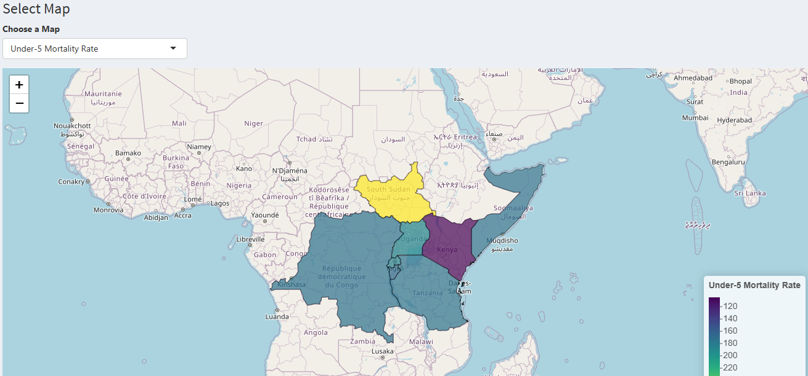
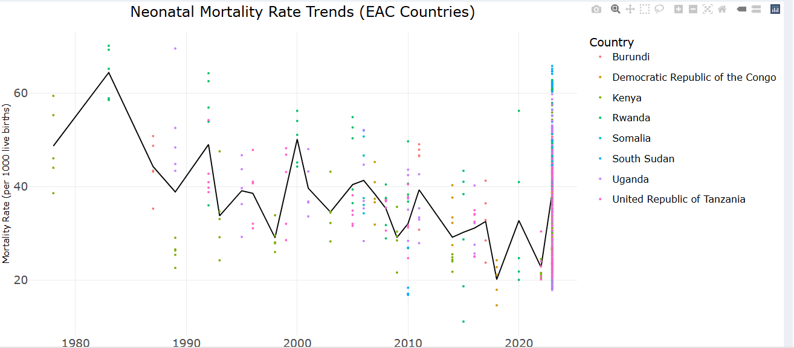

# 🌍 Global Health Analytics Project

## Objective
To analyse global HIV prevalence and its relationship with multidimensional poverty, and to visualise child mortality trends across East African Community (EAC) countries.  
This project combines data cleaning, descriptive analytics, statistical modelling and geospatial mapping.

---

## Dataset Sources
- **HIV data 2000–2023** – WHO / UNAIDS data on people living with HIV  
- **Multidimensional poverty data** – World Bank / UN data on poverty headcount and deprivation factors  
- **Child mortality data** – UN Inter-agency Group for Child Mortality Estimation (U5 and neonatal rates)  
- **Shapefiles** – GADM (administrative boundaries for EAC countries)

---

## Workflow
1. **Data Cleaning**  
   - Extracted numeric HIV estimates from text values  
   - Removed “No data” and `<` estimates  
   - Harmonised poverty dataset column names  
2. **Exploratory Analysis**  
   - Calculated total HIV burden per country and cumulative percentages  
   - Identified countries contributing to 75% of the global burden and within each WHO region  
   - Plotted time-series trends by country and region  
3. **Statistical Modelling**  
   - Merged HIV data with multidimensional poverty indicators  
   - Fitted a mixed-effects model to examine the relationship between HIV prevalence and poverty factors over time  
4. **Mortality Mapping (EAC)**  
   - Filtered under-five and neonatal mortality for 8 EAC countries  
   - Computed latest median estimates  
   - Produced choropleth maps and trend lines for mortality rates  
5. **Visualization**:  
   - Line plots for HIV trends (2000–2023) and mortality rate trends in East African Countries.  
   - Maps showing spatial distribution of under-five and neo-natal mortality rates.  
   - Interactive Shiny dashboard for dynamic filtering.   
6. **Interactive Dashboard**  
   - Built a Shiny dashboard for dynamic exploration of the cleaned datasets  
   - Integrated plots and maps into one interface for end-users
---

## Tools Used
- R (tidyverse, dplyr, ggplot2, lme4, sf, plotly, viridis, scales)  
- Shiny for building an interactive dashboard (app.R, server.R, ui.R)  
- R Markdown for reproducible reporting  
- GitHub for version control and project sharing 

## Key Insights
- **Concentration of HIV burden:** A small cluster of sub-Saharan African countries — led by South Africa, Nigeria and Mozambique — accounts for 75% of the global HIV burden (2000–2023).  
- **Regional variation:** Within each WHO region, the top 75 % of countries show markedly different epidemic trajectories; some are stabilising while others still have rising case counts.  
- **Poverty relationship:** Mixed-effects modelling indicates that higher HIV prevalence is strongly associated with lower multidimensional poverty scores once income is controlled, but low income itself sharply increases poverty levels.  
- **Protective factors:** Higher school enrolment and broader electricity access are both significantly linked to reductions in multidimensional poverty; sanitation, drinking water and educational attainment (years of schooling) were not statistically significant in this model.  
- **Child mortality in the EAC:** Under-five and neonatal mortality rates have been declining on average since 2000, but Somalia (and to a lesser extent South Sudan) continues to record the highest rates among the EAC group.
 
---
## Project Structure
├── shapefiles/
├── HIV data 2000-2023.csv
├── multidimensional_poverty.xlsx
├── dataset_datascience.csv
├── Teresia_Mwagona.Rmd # Main analysis report
├── app.R # Shiny app starter
├── server.R # Shiny server logic
├── ui.R # Shiny UI
├── linechart.png # Screenshot of line chart
├── map.png # Screenshot of map
├── manifest.json
└── README.md

## How to Run
1. Clone the repository.  
2. Place the data files and shapefiles in the paths shown above.  
3. Open `Teresia_Mwagona.Rmd` in RStudio and knit to HTML or Word to reproduce the full report and visualisations.  
4. To launch the interactive dashboard:
   - Open `app.R` (or `server.R` + `ui.R`) in RStudio.
   - Click **Run App** to start the Shiny dashboard locally.

## Dashboard Preview

### Map View

### Line Chart View

---

## Live Dashboard
 [Click here to try the interactive Shiny Dashboard](https://0196803d-274e-45e0-ad5e-9aabf3aafcde.share.connect.posit.cloud/)

